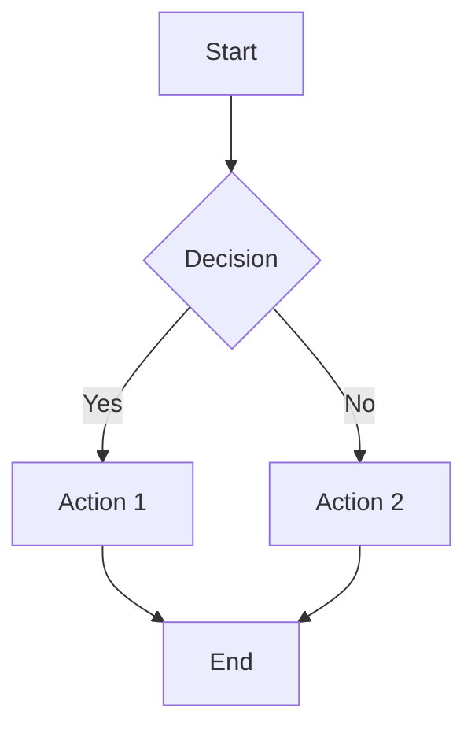

# ADR 0013: Mermaid for Documentation Diagrams

## Status

Accepted

## Context

Technical documentation often includes diagrams to illustrate:

- System architecture
- Data flows
- Component relationships
- Sequence diagrams

Options for creating diagrams in markdown documentation:

1. **ASCII art**: Text-based box diagrams using Unicode characters
2. **Mermaid**: Text-based diagram definition language rendered as SVG
3. **External images**: PNG/SVG files created in tools like draw.io, Lucidchart
4. **PlantUML**: Another text-based diagram language

## Decision

Use Mermaid for all diagrams in documentation.

## Consequences

### Positive

- **Native GitHub support**: GitHub renders Mermaid in markdown files automatically
- **Version control friendly**: Diagrams are text, so diffs are meaningful
- **No external tools**: No need for draw.io, Figma, or other diagram software
- **Consistent styling**: Mermaid applies consistent colors and layout
- **Easy to maintain**: Developers can update diagrams without learning new tools
- **Accessible**: Screen readers can parse the text definition
- **Multiple diagram types**: Supports flowcharts, sequence diagrams, class diagrams, etc.

### Negative

- **Learning curve**: Developers need to learn Mermaid syntax
- **Layout limitations**: Less control over exact positioning than visual tools
- **Complex diagrams**: Very complex diagrams may be harder to express
- **Rendering dependency**: Requires a Mermaid-aware renderer (GitHub, VS Code, etc.)

### Neutral

- **Local preview**: VS Code and other editors have Mermaid preview extensions

## Implementation

### Supported Diagram Types

| Type | Use Case | Example |
|------|----------|---------|
| `flowchart` | Architecture, data flows | System components |
| `sequenceDiagram` | API interactions | Request/response flows |
| `classDiagram` | Object relationships | Module dependencies |
| `stateDiagram` | State machines | UI states |
| `erDiagram` | Data models | Database schemas |

### Syntax Example

```markdown


### Style Guidelines

1. **Use subgraphs** for logical grouping
2. **Keep labels concise** (use line breaks with `<br/>` if needed)
3. **Use meaningful node IDs** (not just A, B, C)
4. **Prefer `flowchart` over `graph`** (newer syntax with more features)
5. **Direction**: Use `TB` (top-bottom) for hierarchies, `LR` (left-right) for flows

## Alternatives Considered

### ASCII Art

```
┌─────────┐     ┌─────────┐
│  Box A  │────▶│  Box B  │
└─────────┘     └─────────┘
```

- Works everywhere without rendering
- But harder to maintain and modify
- Alignment issues across different fonts/editors
- No automatic layout

Rejected because maintenance burden outweighs portability benefits.

### External Image Files

- Maximum visual control
- But requires separate tools to edit
- Binary files don't diff well
- Easy to get out of sync with code

Rejected because it breaks the docs-as-code workflow.

### PlantUML

- More powerful than Mermaid for some diagram types
- But requires Java runtime or server for rendering
- Less native support in GitHub (needs action or proxy)
- More complex syntax

Rejected because Mermaid has better native GitHub support.

## References

- [Mermaid Documentation](https://mermaid.js.org/)
- [GitHub Mermaid Support](https://docs.github.com/en/get-started/writing-on-github/working-with-advanced-formatting/creating-diagrams)
- [VS Code Mermaid Extension](https://marketplace.visualstudio.com/items?itemName=bierner.markdown-mermaid)
