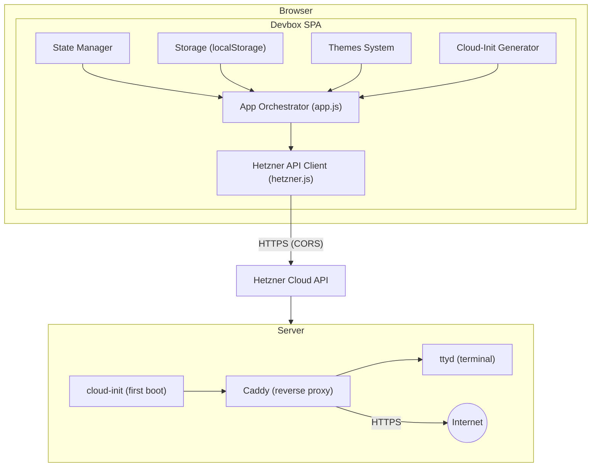
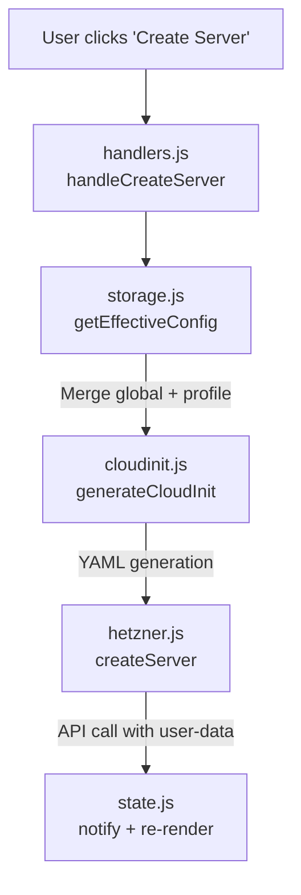
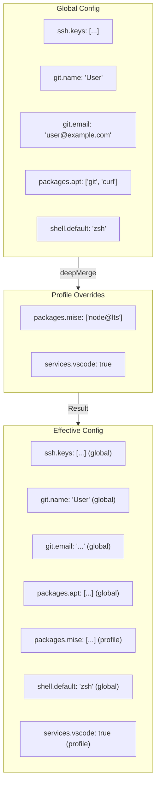
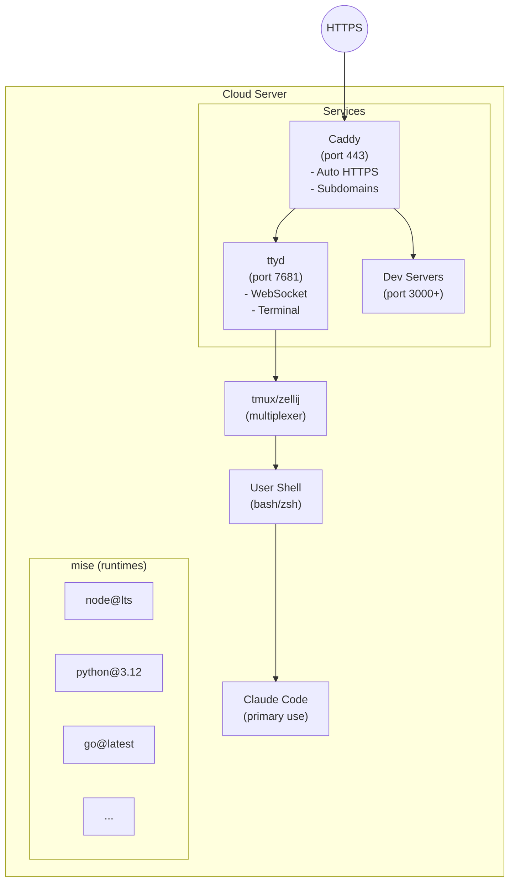
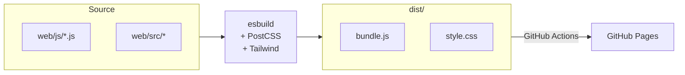

# Architecture Overview

Devbox is a single-page application (SPA) that runs entirely in the browser with no backend server.

## System Architecture



## Module Architecture

### Core Modules

| Module | Responsibility |
|--------|----------------|
| `app.js` | Main orchestrator: initialization, event wiring, API actions |
| `state.js` | Application state, routing, notifications, modals |
| `storage.js` | localStorage wrapper with typed accessors |
| `hetzner.js` | Hetzner Cloud API client (servers, SSH keys, images) |

### UI Modules

| Module | Responsibility |
|--------|----------------|
| `pages.js` | Page renderers (Profiles, Config, Credentials, ProfileEdit) |
| `pages/dashboard.js` | Dashboard page (server list, create form) |
| `pages/cloudinit.js` | Cloud-init preview page |
| `handlers.js` | UI event handlers for form interactions |
| `combobox.js` | Multi-select and single-select combobox components |
| `themes.js` | Theme definitions and CSS variable injection |
| `settings.js` | Settings field definitions and rendering |
| `ui.js` | Design system constants and HTML escaping |

### Generation Modules

| Module | Responsibility |
|--------|----------------|
| `cloudinit.js` | Cloud-init YAML generation engine |
| `cloudinit-builders.js` | Helper functions for cloud-init components |
| `packages.js` | APT and mise package definitions |
| `names.js` | Funny alliterative server name generator |
| `qrcode.js` | QR code generation wrapper |

## Data Flow

### Server Creation Flow



### Configuration Inheritance



## State Management

Devbox uses a simple centralized state pattern:

```javascript
// state.js
let state = {
  servers: [],
  sshKeys: [],
  profiles: [],
  globalConfig: {},
  activeProfile: null,
  notifications: [],
  modal: null,
};

export function setState(updates, callback) {
  Object.assign(state, updates);
  if (callback) callback(state);
}
```

State changes trigger re-renders via explicit callbacks, not automatic reactivity.

## Security Model

### Credential Handling

1. **Hetzner API token**: Stored in localStorage, sent only to Hetzner API
2. **Git credentials**: Embedded in cloud-init, sent to Hetzner as user-data
3. **SSH keys**: Fetched from Hetzner account, not stored locally
4. **Claude API key**: Embedded in cloud-init for server configuration

### XSS Prevention

All user input is escaped before rendering:

```javascript
// ui.js
export function escapeHtml(str) {
  return str.replace(/[&<>"']/g, char => ({
    '&': '&amp;', '<': '&lt;', '>': '&gt;',
    '"': '&quot;', "'": '&#39;'
  })[char]);
}
```

### Content Security Policy

The HTML includes CSP headers restricting script sources and API endpoints.

## Provisioned Server Architecture

When a server is created, cloud-init configures:



## Build Pipeline


