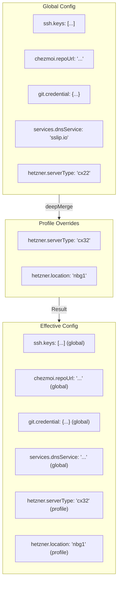
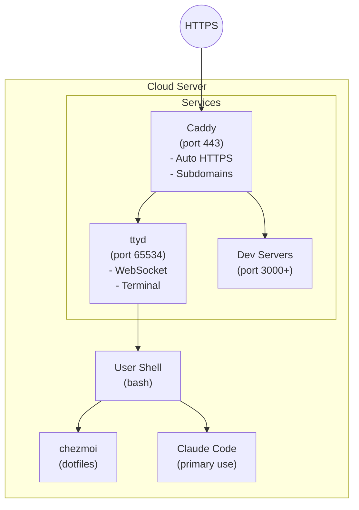

# Architecture Overview

Devbox is a single-page application (SPA) that runs entirely in the browser with no backend server.

## System Architecture


## Tech Stack

- **Framework**: Svelte 5 with runes (`$state`, `$derived`, `$effect`)
- **Language**: TypeScript (strict mode)
- **Build Tool**: Vite 6
- **CSS**: Tailwind CSS v4
- **Package Manager**: pnpm

## Module Architecture

### Core Modules

| Module                       | Responsibility                             |
| ---------------------------- | ------------------------------------------ |
| `src/App.svelte`             | Root component, routing, layout            |
| `src/main.ts`                | Entry point, mounts Svelte app             |
| `src/lib/stores/*.svelte.ts` | Reactive state stores using Svelte 5 runes |
| `src/lib/api/hetzner.ts`     | Hetzner Cloud API client                   |
| `src/lib/utils/storage.ts`   | localStorage wrapper                       |

### UI Components

| Module                       | Responsibility                                         |
| ---------------------------- | ------------------------------------------------------ |
| `src/pages/*.svelte`         | Page components (Dashboard, Config, Credentials, etc.) |
| `src/components/*.svelte`    | Reusable UI components (Nav, ServerCard, etc.)         |
| `src/components/ui/*.svelte` | Base UI components (Button, Card, Input, Modal)        |

### Generation Modules

| Module                                | Responsibility                             |
| ------------------------------------- | ------------------------------------------ |
| `src/lib/utils/cloudinit.ts`          | Cloud-init YAML generation engine          |
| `src/lib/utils/cloudinit-builders.ts` | Helper functions for cloud-init components |
| `src/lib/utils/names.ts`              | Funny alliterative server name generator   |
| `src/lib/utils/qrcode.ts`             | QR code generation                         |

## Data Flow

### Server Creation Flow


### Configuration Inheritance



## State Management

Devbox uses Svelte 5 runes for reactive state:

```typescript
// src/lib/stores/servers.svelte.ts
let servers = $state<Server[]>([]);

export function setServers(newServers: Server[]) {
  servers = newServers;
}

export function getServers() {
  return servers;
}
```

State changes automatically trigger re-renders via Svelte's reactivity system.

## Security Model

### Credential Handling

1. **Hetzner API token**: Stored in localStorage, sent only to Hetzner API
2. **Git credential**: Bootstrap credential embedded in cloud-init for cloning chezmoi repo
3. **SSH keys**: Registered with Hetzner, added to server's authorized_keys
4. **Age key**: Written to server for chezmoi secret decryption

### XSS Prevention

Svelte automatically escapes content in templates. Use `{@html}` carefully:

```svelte
<!-- Safe - auto-escaped -->
<div>{userInput}</div>

<!-- Dangerous - only use with trusted content -->
{@html trustedHtml}
```

### Content Security Policy

The HTML includes CSP headers restricting script sources and API endpoints.

## Provisioned Server Architecture

When a server is created, cloud-init configures:



## Build Pipeline


